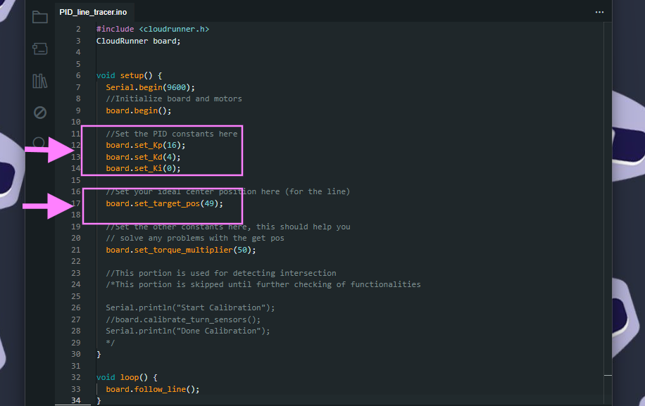

[grayTextColor]: #7C7C7C

# The CloudRunner Project
The goal of this project is to lower the cost barrier to beginning competitive robotics
and in the long term, help elevate people access robotics as a field regardless of their
socio-economic and financial background. 

CHECKING PO 
1. correct? github library link at Downloading and Installing CloudRunner Library
2. add more references for PWM and something about arduino UwU

## About the Repository
This repository hosts all the necessary information about the current rendition of CloudRunner and provides a beginner-friendly library and examples for use with the CloudRunner kit. 

## Installation and Needed Materials 
There are  3 main components needed to start utilizing the CloudRunner: 
1. Arduino IDE (version 2.x.x was used in developing this documentation)
2. CloudRunner Software Library
3. CloudRunner Kit

### Installing the Arduino IDE
First, download the Arduino IDE 2.0 which you can find in the Arduino website (https://www.arduino.cc/en/software).  After downloading, open it and this is what you will see. 


### Downloading and Installing CloudRunner Library to the Arduino IDE 2.x.x
Access the library by going to the [UPCRC CloudRunner GitHub page](https://github.com/UPCRC/CloudRunner) and download the contents by clicking the ***<> Code*** dropdown box > Click ***Download ZIP***.


Next, we will include the CloudRunner library that you downloaded from Github in the Arduino IDE. Go to ***Sketch Tab*** >  ***Include Library*** > ***Add.ZIP Library*** option. Choose the ZIP file you downloaded from Github.


Verify the installation by going to the ***Sketch tab*** again and you should be able to see now in the <span style='color: #7C7C7C;'> Contributed Libraries </span> portion, the ***CloudRunner library*** or for other newer versions, it can be seen under ***Sketch Tab*** >  ***Include Library*** > under <span style='color: #7C7C7C;'> Contributed Libraries </span>.


## Getting Started!
In this section, you learn the basics of robotics namely **(1) Sensor Interfacing**, **(2) Motor Actuation**, and **(3) Basic Line Tracing**

### Introduction to CloudRunner Development Board and its Important Parts


### Sensor Tests
First, go to ***File*** > ***Examples*** > ***CloudRunner*** option which will show you sketches from the library you included. For the Sensor Array Test, click and open the `sensor_array_test`.


Once you open the file, this is what it will look like.
 
**NEEDS UPDATED PICTURE HERE**

Now, connect the board to your laptop using a micro-USB cable. Go to the dropdown menu at the upper-left corner and click ***Select other board and port...***.


A new window will appear similar to this.

On the boards search bar, Select ***Arduino Nano*** 

* If can not selected or not seen, you may need to install the board at the boards manager of the Arduino IDE specifically **Arduino AVR Boards by Arduino** which supports a wide array of development boards including the nano)
    

Next, Select the correct port number on the right side of the window.
* You may verify the correct number via pressing ***Windows + X Key*** > ***Device Manager*** > ***Under Ports*** then check which port number shows up when you connect the microUSB
* Some microUSB cables can not be recognized so make sure your laptop recognizes the cable! *Note: we have observed this problem to be frequent for charger cables included when you bought a phone*

After that click the ***Upload Button***  at the upper left corner and wait for it to complete compiling and uploading. Once done, the data that the sensor is detecting will be displayed in the Serial monitor *(make sure that the baud rate = 9600!)*. Observe the **Centroid or Position** being displayed while you move the robot from left to right in the line. Notice that higher position is shown when the line is at the right of the robot. 

**##Output picture NEEDS HERE**

After getting the centroid, take note of the centroid when the robot is at the center of the line since it will be later used in the PID Line Tracer Sketch / Main Program. 

### Motor Tests
Similar to the Sensor Interfacing,  go to ***File*** > ***Examples*** > ***CloudRunner*** > `motor_test`. This is what you will see once you open it.


As you can see, each wheel has a pair of designated pins and we need to check if it is correct because depending on how the wires were connected, there may be variations which needed to be accounted. Go to the function under `void loop ()`as shown:


As you can see, the Right Motor Pins are commented out (To know more about comments, you may read the Arduino Reference [here](https://arduinogetstarted.com/reference/arduino-block-comment). First, we will test the direction and orientation of the Left Wheel. Upload the program and check if the left wheel is moving forward. 

* If the wheel moving forward is right instead of left, then this pair of pins specifically 14 and 15 as seen in the definition block (lines 2 to 8) are for the right wheel instead. This will also imply that the pins 16 and 17 originally for the right wheel is truly for the control of the left wheel. Hence, swap the pair of pins in the definition block to
    ```
    #define L_speed_pin 9 //D5
    #define R_speed_pin 10 //D6
    #define L_forward 16  //A0
    #define L_backward 17 //A1
    #define R_forward 14  //A2
    #define R_backward 15 //A3
    #define constant_speed 100
    ```
    * Notice we also swapped the speed pins 9 and 10. Reuploading the code will allow you to see that the left wheel will now move forward or backward instead of the right wheel. Now, check and verify the direction. 

* If the wheel is moving backward instead of forward then swap the pins in the definition block to
    ```
    #define L_speed_pin 10 //D5
    #define R_speed_pin 9 //D6
    #define L_forward 15  //A0
    #define L_backward 14 //A1
    #define R_forward 16  //A2
    #define R_backward 17 //A3
    #define constant_speed 100
    ```
    * Swapping the pins should now make the left wheel move forward, reupload the code and verify this behavior

Redo this to the right wheel by commenting the left wheel's code and uncommenting the right wheel's. After the whole process, both wheels' orientation (left or right) and direction (forward and backward) must work correctly. 

For the main program, this mapping must also be used especially if you changed the pins. Go to ***File Explorer*** > ***Documents*** > ***Arduino*** > ***libraries*** > ***CloudRunner*** > ***src*** > ***constants.h***. Open the ***constants.h*** in any text editor, switch the pins assigned under GPIO assignment block to the correct mapping that  you did similar to the definition block and save it. Below is the code that you should have seen and may have altered in the `constants.h` file.

```
//GPIO assignment
#define L_SPEED_PIN 10 //D10
#define R_SPEED_PIN 9 //D9
#define L_FORWARD A0  //A0
#define L_BACKWARD A1 //A1
#define R_FORWARD A3  //A2
#define R_BACKWARD A2 //A3
```
### Main Program
In this part, you will experience and see your first CloudRunner Line Tracing in action!

Go to ***File*** > ***Examples*** > ***CloudRunner*** > click `PID_line_tracer.ino`. Open the file and this is what you will see:



In the `board.set_target_pos ();` line, input the centroid you got from the *Sensor Array Test* inside the parenthesis. This calibrates the robot to have that specific position as reference when following the line. 

Next, you may also set the PID parameters *Kp*, *Kd* and *Ki*. 
To explain briefly, how each parameter affects the robot:
* **Kp (P or proportional)** - determines how large the output changes based on the error, if the error tripled, the proportional term would triple too. Intuitively, this allows the robot to swing faster while following the line. You may also view the movement of the line tracing robot as a sine wave (*snake-y*) hence increasing Kp also increases the frequency of this sine wave.

*  **Kd (D or derivative)** - based on the rate of change of the error and causes the robot to react faster as the error grows. Intuitively, increasing this parameter will make the robot move in a more straight line compared to a *snake-y* movement. You may also view this as reducing the amplitude of the sine wave traced by the robot.

* **Ki (I or integral)** - the integral gain is based on the accumulation of error over time. Ki is only tuned to reduce the steady state error to 0 in which line tracing robots, in this case, does not necessarily need to be in the exact position we had set. Typically, we can calibrate this to be 0.  

First, you can input any value of *Kp, Kd and Ki* and upload the code to your robot. Once uploaded, turn on your robot and place it in the line. Observe if it smoothly follows the line, if it goes over the line or moves in a zigzag manner while following the line, adjust the *Kp* and *Kd* again and then reupload. Play and calibrate with the PID values until you find the optimal values of the PID constants. For each different robot, there will also be different optimal PID values!

## Documentation / References

## Contact Information

## Acknowledgements


